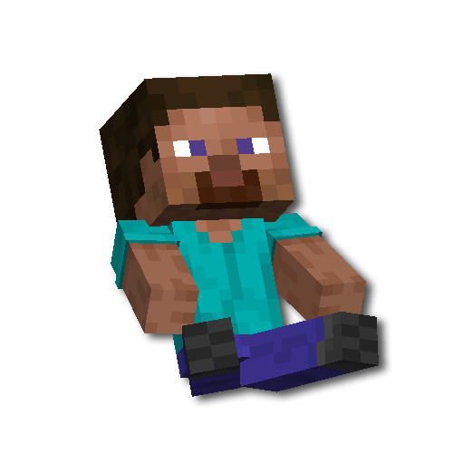

<div align="center">



# SkinTotem

Replaces the Totem of Undying with a 3D doll using your Minecraft skin


[](https://fabricmc.net)


</div>

---

## 📥 Download

<div align="center">


</div>

---

## ✨ Features

| Feature | Description |
|---------|-------------|
| 🎭 Automatic Skin Loading | Fetches player skins directly from the official Mojang API |
| 💾 Caching | Skins are cached for 10 minutes to reduce API requests |
| 🎨 Slim / Classic Support | Supports both Alex and Steve player models |
| 🌐 Multiplayer Compatible | Works on any server without requiring a server-side mod |
| ⚙️ Configurable | Fully configurable through ModMenu + Cloth Config |
| 🔧 NBT Customization | Customize individual totems via an anvil |
| 🎬 Activation Animation | Smooth and immersive totem activation animation |

---

## 📦 Installation

1. Install [Fabric Loader](https://fabricmc.net) for Minecraft 1.20.1 — 1.21.11
2. Install [Fabric API](https://modrinth.com/mod/fabric-api)
3. Download `skintotem-1.0.0.jar` and place it in your `mods/` folder
4. **Optional:** Install [ModMenu](https://modrinth.com/mod/modmenu) and [Cloth Config](https://modrinth.com/mod/cloth-config) for an in-game configuration GUI

---

## 🎮 Usage

### Automatic Mode

Simply hold a Totem of Undying in your hand — it will automatically display your skin.

### Custom Skin (via Anvil)

Place a Totem of Undying into an anvil and rename it using one of the formats below:

| Format | Provider | Example |
|--------|----------|---------|
| `Notch` | Mojang | `Notch` |
| `#Notch` | TLauncher | `#Notch` |
| `@Notch` | Ely.by | `@Notch` |
| `NameMC\|Notch` | NameMC | `NameMC\|Notch` |

### Commands

```
/skintotem                     — Show help
/skintotem refresh             — Refresh the current player's skin
/skintotem refresh <player>    — Refresh a specific player's skin
/skintotem refresh all         — Clear the entire skin cache

/totem <nickname>              — Set totem skin (Mojang)
/totem tl <nickname>           — Set totem skin (TLauncher)
/totem ely <nickname>          — Set totem skin (Ely.by)
/totem url <link>              — Set totem skin from URL
/totem model <model_id>        — Change the default doll model
/totem refresh                 — Force Mojang API fallback refresh
```

---

## ⚙️ Configuration (ModMenu)

| Setting | Default | Description |
|---------|---------|-------------|
| Use Current Player Skin | ✅ | Automatically use your own skin |
| Default Username | — | Used when automatic skin loading is disabled |
| Render in First Person | ✅ | Display the totem in first-person view |
| Show Cape | ✅ | Render the player's cape |
| Scale | 1.0 | Doll size (0.5–2.0) |
| Y Rotation | 0° | Rotation angle of the doll |
| Activation Animation | ✅ | Play animation when the totem is activated |

---

## 📋 Dependencies

| Mod | Required | Description |
|-----|----------|-------------|
| Fabric API | ✅ | Core Fabric API dependency |
| ModMenu | ❌ | Adds a settings button to the mod list |
| Cloth Config | ❌ | Configuration GUI library |
| YetAnotherConfigLib (YACL) | ❌ | Alternative configuration GUI library |

---

## 👥 Credits

| Role | Contributor |
|------|-------------|
| 👨‍💻 Mod Author | Darkz, KlashRaick, LopyMine |
| 🏆 Team | K-TEAM |
| 💛 Special Thanks | KlashRaick |

Inspired by the [SkinTotem](https://github.com/darkz70/SkinTotem) and [My-Totem-Doll](https://github.com/LopyMine/my-totem-doll) projects.

---

<div align="center">

Made with ❤️ by Darkz | K-TEAM | KlashRaick | LopyMine

</div>
