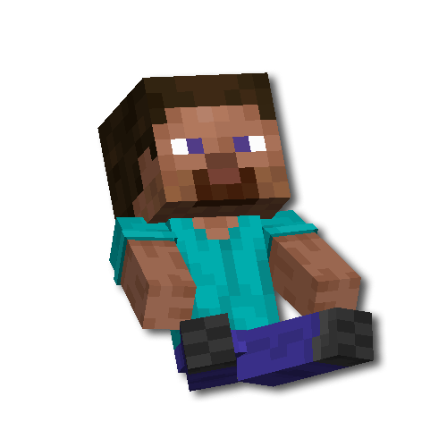

<div align="center">



# SkinTotem

Replaces the Totem of Undying with a 3D doll using your Minecraft skin


[](https://fabricmc.net)


</div>

---

## 📜 Changelog

See [CHANGELOG.md](CHANGELOG.md) — every release is described in English and Russian.
См. [CHANGELOG.md](CHANGELOG.md) — каждая версия описана на английском и русском.

---

## 📥 Download

<div align="center">


</div>

---

## ✨ Features

| Feature | Description |
|---------|-------------|
| 🎭 Automatic Skin Loading | Fetches player skins directly from the official Mojang API |
| 💾 Caching | Skins are cached for 10 minutes to reduce API requests |
| 🎨 Slim / Classic Support | Supports both Alex and Steve player models |
| 🌐 Multiplayer Compatible | Works on any server without requiring a server-side mod |
| ⚙️ Configurable | Fully configurable through ModMenu + YACL |
| 🔧 NBT Customization | Customize individual totems via an anvil |
| 🎬 Activation Animation | Smooth and immersive totem activation animation |
| 🔊 Custom Sounds | Own sounds for totem activation, summoning the doll, and skin loading |
| 🕺 Emotecraft Support | The doll mirrors the emote you are playing, and can trigger an emote when the totem saves you |
| 📂 Sound Pack Folder | Drop your own audio files into `config/skintotem/sounds` — any format, converted automatically |
| 🌍 7 Languages | English, Русский, Українська, Deutsch, Polski, 日本語, Татарча |

---

## 📦 Installation

1. Install [Fabric Loader](https://fabricmc.net) for Minecraft 1.20.1 — 26.3
2. Install [Fabric API](https://modrinth.com/mod/fabric-api)
3. Download `skintotem-2.0.4.jar` and place it in your `mods/` folder
4. **Optional:** Install [ModMenu](https://modrinth.com/mod/modmenu) and [YACL](https://modrinth.com/mod/yacl) for an in-game configuration GUI

---

## 🎮 Usage

### Automatic Mode

Simply hold a Totem of Undying in your hand — it will automatically display your skin.

### Custom Skin (via Anvil)

Place a Totem of Undying into an anvil and rename it using one of the formats below:

| Format | Provider | Example |
|--------|----------|---------|
| `Notch` | Mojang | `Notch` |
| `#Notch` | TLauncher | `#Notch` |
| `@Notch` | Ely.by | `@Notch` |
| `NameMC\|Notch` | NameMC | `NameMC\|Notch` |

### Commands

```
/skintotem                     — Show help
/skintotem refresh             — Refresh the current player's skin
/skintotem refresh <player>    — Refresh a specific player's skin
/skintotem refresh all         — Clear the entire skin cache
/skintotem sounds              — Show the custom sound folder and loaded files
/skintotem sounds reload       — Reload sound files from the folder

/totem <nickname>              — Set totem skin (Mojang)
/totem tl <nickname>           — Set totem skin (TLauncher)
/totem ely <nickname>          — Set totem skin (Ely.by)
/totem url <link>              — Set totem skin from URL
/totem model <model_id>        — Change the default doll model
/totem refresh                 — Force Mojang API fallback refresh
```

---

## 🔊 Custom Sounds

Put your own audio files into `config/skintotem/sounds` (the folder and a `README.txt` are created
on first launch). Name the file after the sound you want to replace:

| File name | Plays when |
|-----------|------------|
| `totem_activate` | the totem saves you |
| `doll_summon` | a doll appears in your hand |
| `skin_change` | a skin was loaded successfully |
| `skin_error` | a skin could not be loaded |

* `.ogg`, `.wav`, `.aiff` and `.au` are used as they are — no resampling, no volume changes.
* Other formats (`.mp3`, `.m4a`, `.flac`, `.opus`, ...) are converted automatically if **ffmpeg** is
  installed; the result is cached, so conversion happens only once per file.
* Several files for one sound (`skin_change_1.ogg`, `skin_change_2.ogg` or a `skin_change/` folder)
  become random variants.
* Changes are applied on resource reload (F3+T) or with `/skintotem sounds reload`.

---

## ⚙️ Configuration (ModMenu)

| Setting | Default | Description |
|---------|---------|-------------|
| Use Current Player Skin | ✅ | Automatically use your own skin |
| Default Username | — | Used when automatic skin loading is disabled |
| Render in First Person | ✅ | Display the totem in first-person view |
| Show Cape | ✅ | Render the player's cape |
| Scale | 1.0 | Doll size (0.5–2.0) |
| Y Rotation | 0° | Rotation angle of the doll |
| Activation Animation | ✅ | Play animation when the totem is activated |
| Mod Sounds | ✅ | Enable the mod's own sound effects |
| Sound Volume | 1.0 | Volume multiplier for the mod's sounds (0.0–2.0) |
| Replace Totem Sound | ❌ | Play the mod's sound instead of the vanilla totem sound |
| Mirror Emotes | ✅ | The doll in your hand repeats your Emotecraft emote |
| Activation Emote | — | Name of the emote to play when the totem saves you (empty = off) |
| Sounds From Folder | ✅ | Use your own files from `config/skintotem/sounds` |
| Convert Any Format | ✅ | Convert formats Minecraft cannot read (mp3, flac, ...) with ffmpeg |

---

## 📋 Dependencies

| Mod | Required | Description |
|-----|----------|-------------|
| Fabric API | ✅ | Core Fabric API dependency |
| ModMenu | ❌ | Adds a settings button to the mod list |
| YetAnotherConfigLib (YACL) | ❌ | Alternative configuration GUI library |
| [Emotecraft](https://modrinth.com/mod/emotecraft) | ❌ | Enables emote mirroring on the doll and the activation emote |

---

## 🌍 Languages

| Language | Status |
|----------|--------|
| English (`en_us`) | ✅ complete |
| Русский (`ru_ru`) | ✅ complete |
| Українська (`uk_ua`) | ✅ complete |
| 日本語 (`ja_jp`) | ✅ complete |
| Polski (`pl_pl`) | ✅ complete |
| Deutsch (`de_de`) | ✅ complete |
| Татарча (`tt_ru`) | 🚧 in progress |

New languages are added release by release. Pull requests with translations are welcome — copy
`src/main/resources/assets/skintotem/lang/en_us.json` and translate the values.

---

## 👥 Credits

| Role | Contributor |
|------|-------------|
| 👨‍💻 Mod Author | Darkz |

Inspired by the [SkinTotem](https://github.com/darkz70/SkinTotem) and [My-Totem-Doll](https://github.com/LopyMine/my-totem-doll) projects.

---

<div align="center">

Made with ❤️ by Darkz

</div>
